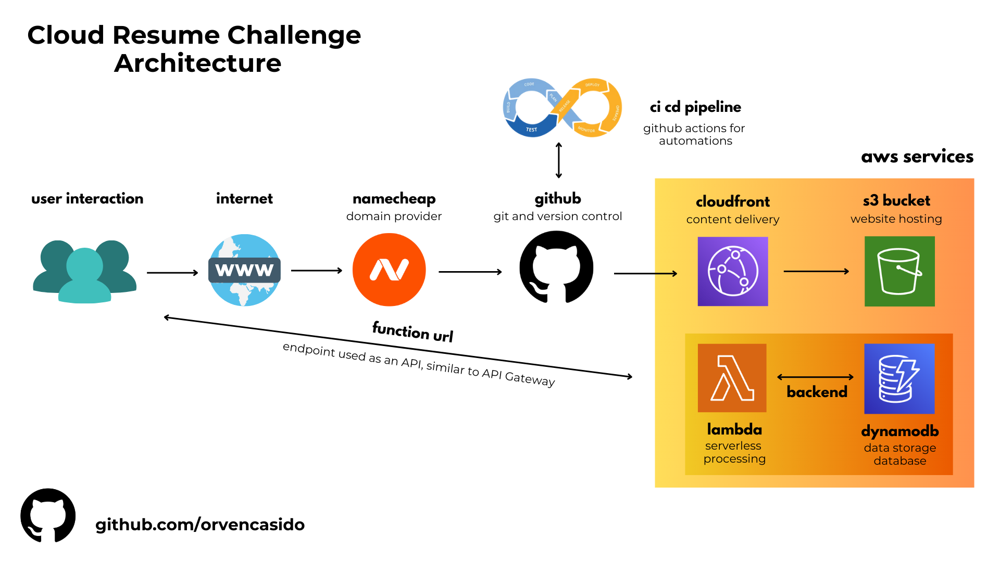

# AWS Cloud Resume Challenge

This is my attempt on the Cloud Resume Challenge. I used AWS technologies to deploy my resume as a static website, integrating services like S3 for hosting, CloudFront for content delivery, and Route 53 for domain management

Cloud Resume Challenge- A comprehensive, multi-step project aimed at developing and demonstrating key cloud skills necessary for a career in the industry. The challenge was initiated by Forrest Brazeal.

## System Architecture

